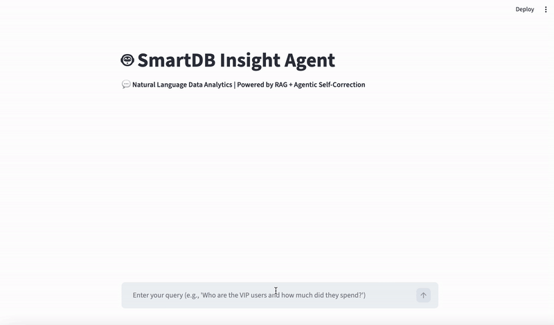

# 🤖 SmartDB Insight Agent 

> **A robust Text-to-SQL Analytics Agent featuring RAG-based context injection and self-healing agentic workflows.**

This project is a production-oriented implementation of Natural Language to SQL (NL2SQL). It bridges the gap between human business logic and technical database schemas by utilizing an **Autonomous Agent** that can reason, execute, and self-correct.

### 📺 Live Demo Screenshot


---

## 🌟 Key Features

* **Agentic Self-Correction**: When a SQL execution fails, the agent captures the database error (traceback) and automatically attempts to fix the syntax or logic (up to 3 retries).
* **RAG-Enhanced Logic**: Injects database metadata and specific business rules (e.g., "What defines a VIP user?") into the LLM context to eliminate hallucinations and ensure deterministic results.
* **Streamlit Web UI**: A clean, interactive dashboard allowing users to query data and visualize results in real-time.
* **Security First**: Implemented environment variable management for sensitive API credentials using `python-dotenv`.

---

## 🏗️ Technical Architecture


The system follows a 4-layer architecture to ensure reliability:

1.  **Input Layer**: User submits a query in natural language via the Streamlit interface.
2.  **RAG Layer**: The system retrieves relevant schema metadata and business definitions (e.g., `VIP = Age > 30`).
3.  **Inference Layer**: The LLM (GLM-4 / GPT) reasons through the request and generates a candidate SQLite query.
4.  **Self-Correction Loop**: If the database throws an error, the error log is fed back to the LLM as a "critique" to generate a refined query.

---

## 🛠️ Tech Stack

* **LLM**: Zhipu AI (GLM-4) / OpenAI API
* **App Framework**: Streamlit (Python)
* **Data Handling**: Pandas, SQLite3
* **Environment**: Python 3.10+, Dotenv for secure credential management

---

## 🚀 Getting Started

### 1. Prerequisites
- Python 3.10 or higher
- A Zhipu AI or OpenAI API Key

### 2. Installation
```bash
# Clone the repository
git clone https://github.com/gcheng81/smart-db-insight-agent.git
cd smart-db-insight-agent

# Create and activate environment
conda create -n ai_env python=3.10 -y
conda activate ai_env

# Install dependencies
pip install -r requirements.txt
```

### 3. Configuration
Create a `.env` file in the root directory and add your API key:

```text
ZHIPU_API_KEY=your_actual_api_key_here
```

### 4. Run the Application
```bash
streamlit run app.py
```